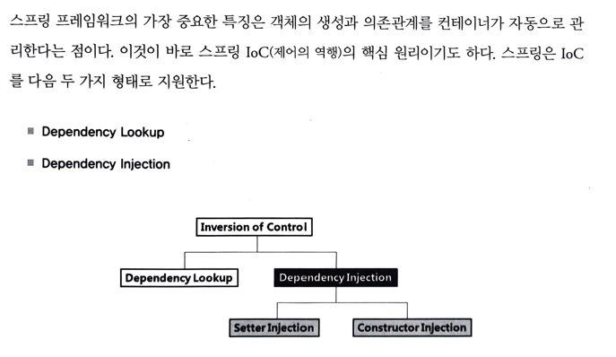
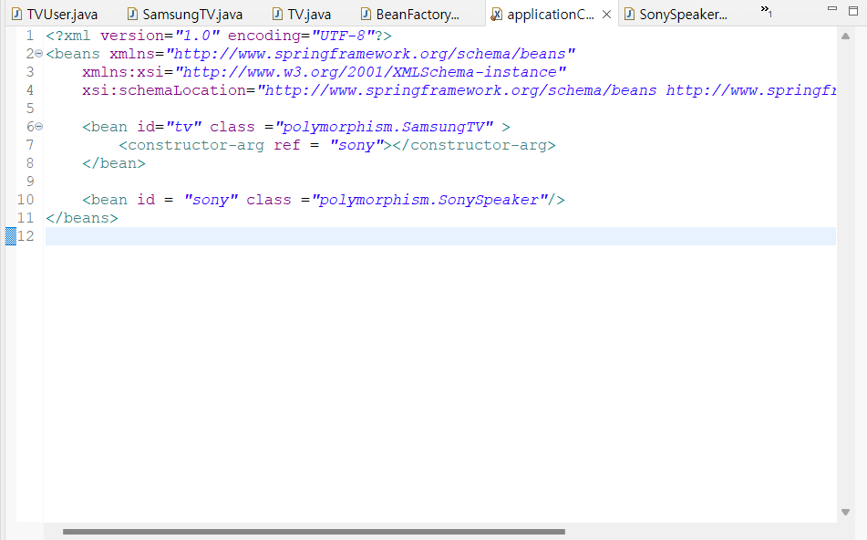
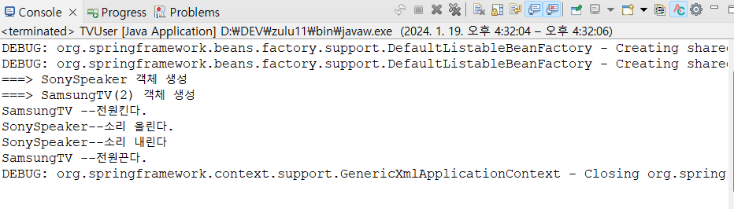
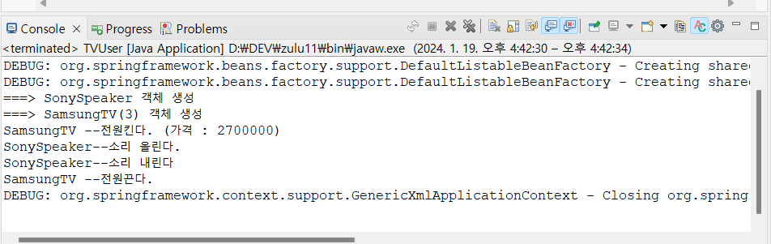
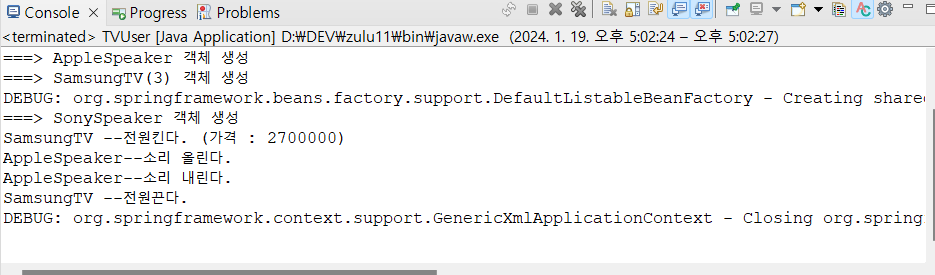
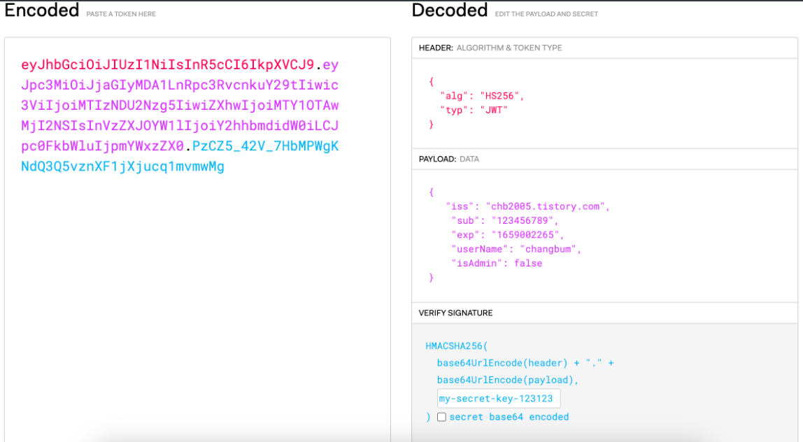

단순 spring 공부한거 정리한 문서

# :pushpin: 1.BoardWeb 

### :rabbit: 다형성 이용
<details>
<summary>자세히</summary>
<div markdown="1">

: TV 클래스들의 최상위 부모로 사용할 TV 인터페이스를 추가하고, 추상메소드로 선언.

</div>
</details>

### :rabbit: 디자인 패턴 이용
<details>
<summary>자세히</summary>
<div markdown="1">

: 객체 생성을 캡슐화. 대신 실행할때, argument(SamsungTV, lgTV) 중 한개 넘겨야함.


</div>
</details>


### :rabbit: 스프링 컨테이너 이용
<details>
<summary>자세히</summary>
<div markdown="1">

-  TVUser 클라이언트가 스프링 설정 파일을 로딩하여 컨테이너 구동
- 스프링 설정 파일에 </bean/> 등록된 SamsungTV 객체 생성
- getBean() 메소드로 이름이 'tv'인 객체를 요청
- SamsungTV 객체 반환


</div>
</details>

### :rabbit: 스프링 컨테이너 속성 실습
<details>
<summary>자세히</summary>
<div markdown="1">

- init-method : 객체 생성 후 멤버변수 등 초기화 작업
- destroy-method : 객체 삭제 전 작업
- lazy-init : 컨테이너가 구동되는 시점에 객체 생성이 아닌 </bean/>이 사용되는 시점에 객체를 생성하도록 하는 속성
- scope : singleton (객체 한번만 생성 가능) vs prototype  (객체 여러번 생성 가능)


</div>
</details>

### :rabbit: 의존성 관리
<details>
<summary>자세히</summary>
<div markdown="1">

Dependency lookup은 지금까지 사용한 것이고
실제 웹을 만들때는 Dependency injection을 사용한다

- 의존성 : 객체와 객체간의 결합관계
&nbsp;
<br>
<br>
기본적인 객체를 사용하는 객체는 아래와 같다.

<br> :angry: **문제** : SonySpeaker가 쓸데없이 2개 생성되고,<br>
&nbsp;&nbsp;&nbsp;&nbsp;&nbsp;운영과정에서 SonySpeaker 성능이 떨어져서 AppleSpeaker 와 같은 다른 speaker로 변경하고자 할때, 두 메소드(VolumeUp, VolumeDown)을 모두 수정해야하는 번거로움이 있다.

=> 의존성 주입을 통해 해결
--- 
### :thumbsup: 생성자 인젝션 사용




스프링 컨테이너는 기본적으로 bean 등록된 순서대로 객체를 생성하며, 모든 객체는 기본 생성자 호출을 원칙으로 한다

그런데 생성자 인젝션으로 의존성 주입될 SonySpeaker 가 먼저 객체 생성되었으며 SonySpeaker 객체를 매개변수로 받아들이는 생성자를 호출하여 객체를 생성하였다

#### 다중 멥핑
생성자 인젝션으로 멤버변수 초기화를 여러개 할 수 있다.
이때는 constructor-arg 태그를 여러개 xml파일에 넣으면 된다.



-> 이로써 SonySpeaker 가 두개가 되는 일은 해결되었다
<br>
<br>
<br>
#### 의존 관계 변경

스프링 설정 파일만 적절히 관리하면 동작하는 TV도 변경가능하고, TV가 사용하는 스피커도 변경가능하다.
이 과정에서 :smile: 어떤 자바 코드도 변경하지 않는다.:smile:



### :thumbsup: setter 인젝션

생성자 인젝션보다 setter 인젝션을 많이 사용한다

</details>

### :rabbit: 어노테이션 기반 설정 


<details>
<summary>자세히</summary>
<div markdown="1">

[참고 블로그](https://velog.io/@gillog/Spring-Annotation-%EC%A0%95%EB%A6%AC) :내용을 아주 잘 정리해서 가져와봤다.
<br>
<br>

> @Component
- 개발자가 직접 작성한 class를 bean으로 등록하기 위한 Annotation이다.
- Component에 대한 추가 정보가 없다면 Class의 이름을 camelCase로 변경한 것이 Bean id로 사용된다.
> @Autowired
- 기본 생성자가 없을 때, 매개변수가 존재한다면, 이를 주입시키기 위해 사용
> @Qualifier
- 의존성 주입될 객체의 아이디나 이름을 지정할 수 있음.

=> 'XML 설정' 과 어노테이션을 적절히 혼용해서 사용해야함.

</div>
</details>

### :rabbit: 비즈니스 컴포넌트 실습1
<details>
<summary>자세히</summary>
<div markdown="1">

결과:


</div>
</details>

# :pushpin: :rabbit: JWT Token 로그인 구현
<details>
<summary>자세히</summary>
<div markdown="1">

## JWT란
- JSON Web Token의 줄임말로 JSON 객체로 정보를 주고 받을 때, 안전하게 전송하기 위한 방식

- HMAC, RSA 등의 암호화 방식을 사용해 서명함
- 로그인 기능 구현 등에 사용

## JWT 구조
- JWT는 Header, Payload, Signature로 이루어져 있으며 각각 점으로 구분

- ex) xxxxxxx.yyyyyyy.zzzzzzzzz



### Header
- Header는 일반적으로 토큰 유형(JWT)와 사용중인 서명 알고리즘이 포함됨
```bash
{
    "typ": "JWT",
    "alg": "HS256"
}
```

### Payload
- Payload는 등록된 클레임과 개인 클레임 등으로 이루어짐
- 등록된 클레임 : iss(발행자), exp(만료시간), sub(제목), aud(대상) 등이 있음 => 권장되긴 하지만 필수는 아님
- 개인 클레임 : 서로 정보를 공유하기 위해 생성된 사용자 지정 클레임 => 원하는 정보들을 넣으면 됨
```bash
{
    // 등록된 클레임
    "iss": "chb2005.tistory.com",
    "sub": "123456789",
    "exp": "1659002265",
    // 개인 클레임
    "userName": "changbum",
    "isAdmin": false
}
```

### Signature
- Signature은 Header, Payload, Secret Key를 합쳐 암호화한 결과값
- HS256( base64UrlEncode(header) + "." + base64UrlEncode(payload), Secret key)


- header와 payload의 값은 Decoding을 통해 누구나 정보를 알아낼 수 있는데, Signature 값은 지정한 비밀키를 알아야만 구할 수 있음.

예시 )

- 유저 A가 B 사이트에 로그인 하는 상황
1. A가 id, password를 B 서버에 전송
2. B 서버가 DB에서 확인 후 id, password가 맞다면 B만 아는 비밀키를 사용해 토큰을 만들어 A에게 전송해 줌
3. A는 이 토큰을 들고있다가 다른 요청시 이 토큰을 헤더에 담아서 보내줌
- ex) 발급받은 Jwt Token이 'xxxx.yyyy.zzzzz'라면
A가 B에 요청 전송시 Request Header의 'Authorization'에 'Bearer xxxx.yyyy.zzzzz'를 담아 전송
4. 요청과 토큰을 받은 B는 토큰을 통해 사용자를 인증하고 요청에 대한 응답을 진행
5. 만약 유저 A가 Payload에 유저 정보를 바꿔 다른 유저인 것 처럼 접근하려 해도 비밀키를 모르기 때문에 정확한 Signature을 만들 수 없음

## JWT 장점
- 서버는 비밀키만 알고 있으면 되기 때문에 세션 방식과 같이 별도의 인증 저장소가 필요하지 않음 => 서버측 부하 감소

## JWT 구현 예제 
</div>
</details>