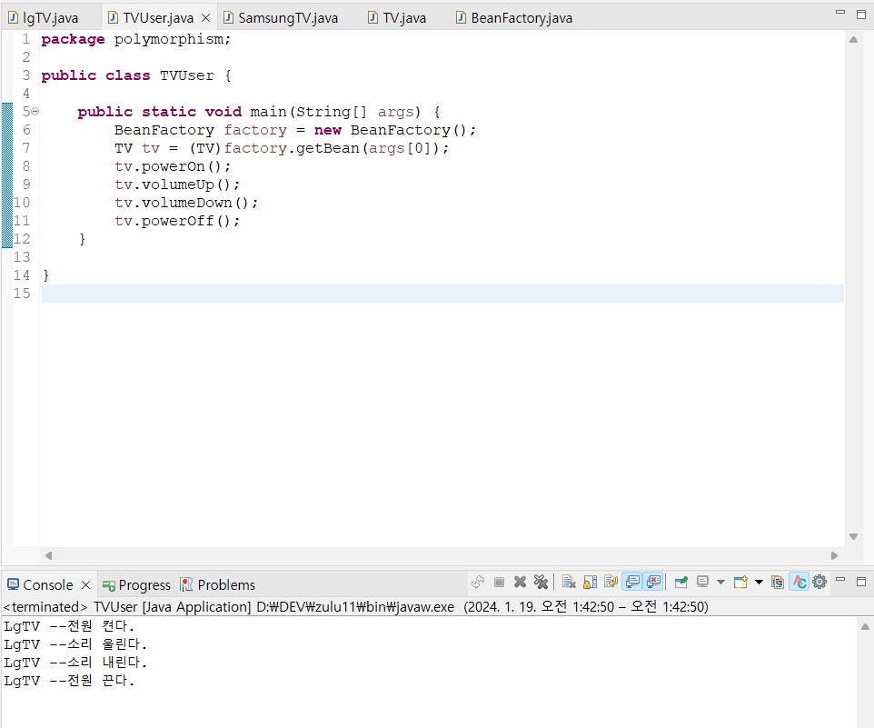
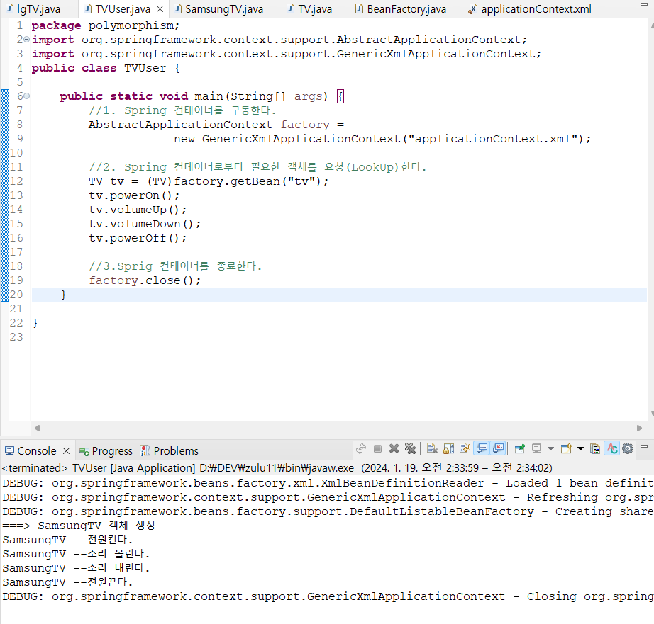
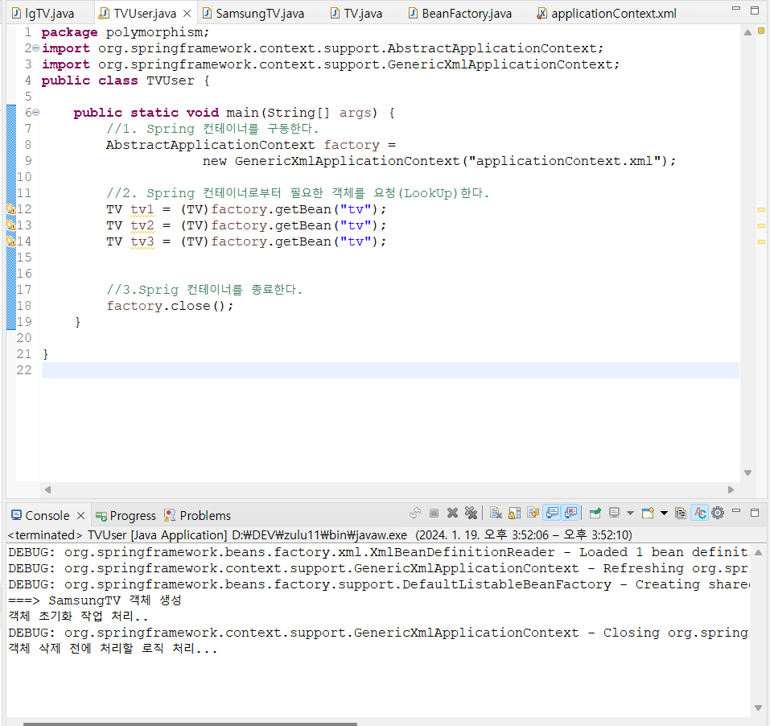
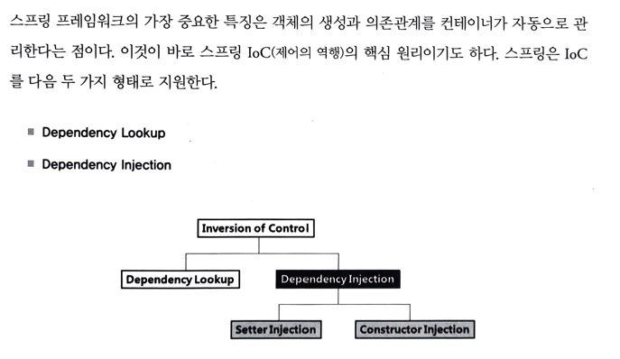
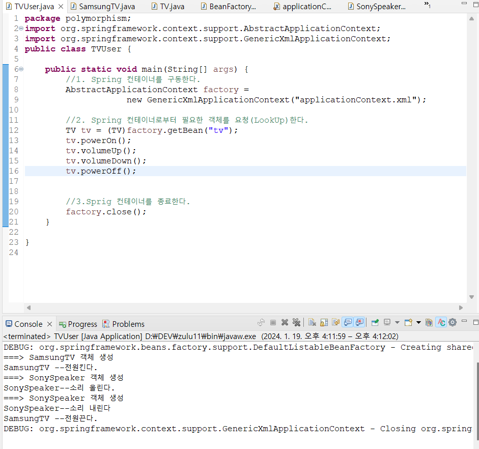
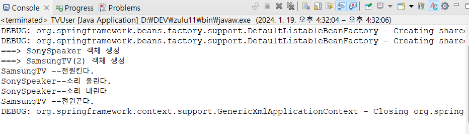
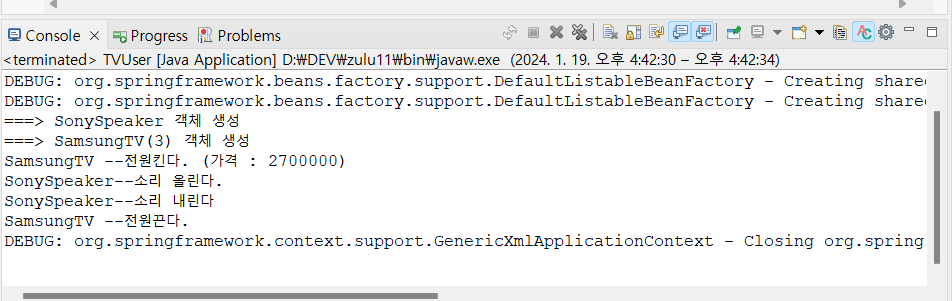
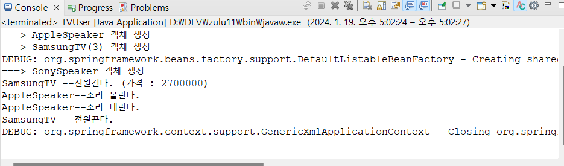
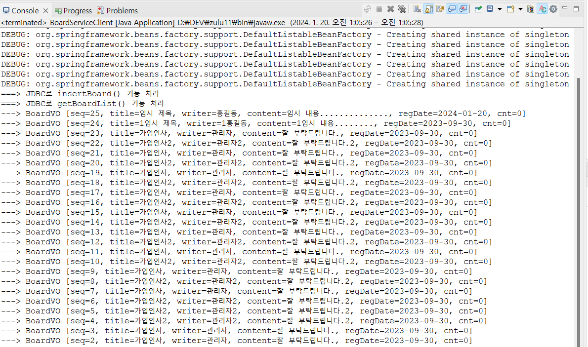

단순 spring 공부한거 정리한 문서

## :pushpin: 1.BoardWeb 

### :rabbit: 다형성 이용

자세히

: TV 클래스들의 최상위 부모로 사용할 TV 인터페이스를 추가하고, 추상메소드로 선언.

### :rabbit: 디자인 패턴 이용

자세히

: 객체 생성을 캡슐화. 대신 실행할때, argument(SamsungTV, lgTV) 중 한개 넘겨야함.

### :rabbit: 스프링 컨테이너 이용

자세히

-  TVUser 클라이언트가 스프링 설정 파일을 로딩하여 컨테이너 구동
- 스프링 설정 파일에 </bean/> 등록된 SamsungTV 객체 생성
- getBean() 메소드로 이름이 'tv'인 객체를 요청
- SamsungTV 객체 반환

### :rabbit: 스프링 컨테이너 속성 실습

자세히

- init-method : 객체 생성 후 멤버변수 등 초기화 작업
- destroy-method : 객체 삭제 전 작업
- lazy-init : 컨테이너가 구동되는 시점에 객체 생성이 아닌 </bean/>이 사용되는 시점에 객체를 생성하도록 하는 속성
- scope : singleton (객체 한번만 생성 가능) vs prototype  (객체 여러번 생성 가능)

### :rabbit: 의존성 관리

자세히

Dependency lookup은 지금까지 사용한 것이고
실제 웹을 만들때는 Dependency injection을 사용한다

- 의존성 : 객체와 객체간의 결합관계
&nbsp;
 
 
기본적인 객체를 사용하는 객체는 아래와 같다.

  :angry: **문제** : SonySpeaker가 쓸데없이 2개 생성되고, 
&nbsp;&nbsp;&nbsp;&nbsp;&nbsp;운영과정에서 SonySpeaker 성능이 떨어져서 AppleSpeaker 와 같은 다른 speaker로 변경하고자 할때, 두 메소드(VolumeUp, VolumeDown)을 모두 수정해야하는 번거로움이 있다.

=> 의존성 주입을 통해 해결
--- 
### :thumbsup: 생성자 인젝션 사용

스프링 컨테이너는 기본적으로 bean 등록된 순서대로 객체를 생성하며, 모든 객체는 기본 생성자 호출을 원칙으로 한다

그런데 생성자 인젝션으로 의존성 주입될 SonySpeaker 가 먼저 객체 생성되었으며 SonySpeaker 객체를 매개변수로 받아들이는 생성자를 호출하여 객체를 생성하였다

#### 다중 멥핑
생성자 인젝션으로 멤버변수 초기화를 여러개 할 수 있다.
이때는 constructor-arg 태그를 여러개 xml파일에 넣으면 된다.

-> 이로써 SonySpeaker 가 두개가 되는 일은 해결되었다
 
 
 
#### 의존 관계 변경

스프링 설정 파일만 적절히 관리하면 동작하는 TV도 변경가능하고, TV가 사용하는 스피커도 변경가능하다.
이 과정에서 :smile: 어떤 자바 코드도 변경하지 않는다.:smile:

### :thumbsup: setter 인젝션

생성자 인젝션보다 setter 인젝션을 많이 사용한다

### :rabbit: 어노테이션 기반 설정 

자세히

[참고 블로그](https://velog.io/@gillog/Spring-Annotation-%EC%A0%95%EB%A6%AC) :내용을 아주 잘 정리해서 가져와봤다.
 
 

> @Component
- 개발자가 직접 작성한 class를 bean으로 등록하기 위한 Annotation이다.
- Component에 대한 추가 정보가 없다면 Class의 이름을 camelCase로 변경한 것이 Bean id로 사용된다.
> @Autowired
- 기본 생성자가 없을 때, 매개변수가 존재한다면, 이를 주입시키기 위해 사용
> @Qualifier
- 의존성 주입될 객체의 아이디나 이름을 지정할 수 있음.

=> 'XML 설정' 과 어노테이션을 적절히 혼용해서 사용해야함.

### :rabbit: 비즈니스 컴포넌트 실습1

자세히

결과:

